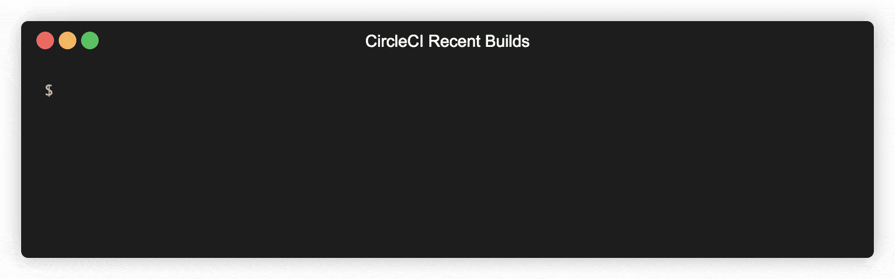

# CircleCI Recent Builds

[](https://npmjs.org/package/circleci-recent-builds)
[](https://npmjs.org/package/circleci-recent-builds)
[](https://github.com/ChristianBoehlke/circleci-recent-builds/blob/master/LICENSE)

Interactive CLI tool that displays recent CircleCI builds.



## Features

- Recent builds will be loaded every 5 seconds to update the UI.
- Estimated finish times are based on the last successful build.
- Colors indicate the outcome of the build.
- The CLI adapts to the width and height of your console window.

## Install

```
$ npm install -g circleci-recent-builds
```

## Usage

You need to create a CircleCI "Personal API Token" at
https://circleci.com/account/api. Then run:

```
$ cci-watch token <your token>
Token set.
```

Afterwards, you can see all your recent builds by just running:

```
$ cci-watch
acme-corp-backend  4770   master      Queued ...
acme-corp-web      43274  develop     [======================                              ] 43%
acme-corp-backend  4769   develop     https://circleci.com/gh/acme-corp/acme-corp-backend/4769
```
